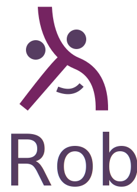

<p align="center">
  
</p>

<p align="center">
Simple projects generator written in Haskell
</p>

---
> Call on me in the day of trouble, and I will deliver, and thou shalt glorify me.</p>
###### Daniel Defoe, Robinson Crusoe

# Installation

```shell
$ cabal install rob
```

# Usage

Before using Rob you need to scaffold your projects templates.
If for example you work often with nodejs you can create your `nodejs` template from scratch.
Let's see then how to create a new Rob template.

## Template setup

Create a folder anywhere on your machine.
Put in this folder all the files/folders you want to use anytime you will chose this template.
For example for the `nodejs` template you may have a folder structure that looks like this:

```
nodejs
│--package.json
│--README.md
│--travis.yml
│--.gitignore
└───src
│   │--index.js
└───test
    │--runner.js
    │--expect.js
```

### The `project.yml` file

Rob relies on a single file that __you must include__ in the root of your templates folders.
This file is called __`project.yml`__

For example, the `nodejs` template must also contain an additional `project.yml` file:

```
nodejs
│--project.yml
│--package.json
│--README.md
...
```

The `project.yml` file will contain all the questions needed to render your project files.
Depending on your answer to these questions Rob will be able to generate a (key, value) data
structure that will be available in any project file to customize your project however you like

A typical `project.yml` might look like this:

```yml
questions:
  name:
    question: What's the name of the project?
    type: input
    default: foo

  description:
    question: Project description?

  test_framework:
    question: Which test framework do you want to use?
    type: select
    default: mocha
    answers:
      - mocha
      - jasmine
      - tap

  babel_preset:
    question: Which babel preset do you want to use?
    type: multiselect
    default:
      - babel-preset-env
    answers:
      - babel-preset-env
      - babel-preset-es2015
      - babel-preset-es2016
      - babel-preset-es2017

  is_public:
    question: Is it public?
    type: confirm

  password:
    question: What's your password?
    type: password
```

The kind of answers type supported are only `input`, `confirm`, `select`, `multiselect` and `password`.

### Template engine

Rob uses [EDE](https://hackage.haskell.org/package/ede) as template engine.
Any time you will create a new project with Rob, all the files of the template selected will be parsed rendered via EDE using the answers provided with the `project.yml`.
For example the `package.json` in your `nodejs` template might be:

```
{
  "name": "{{name}}",
  
    "public": true,
  
  ...
}
```

Please check the [EDE](http://brendanhay.nz/ede/Text-EDE.html) to see all the available expression. However if you have already used [Liquid](https://github.com/Shopify/liquid) or [Jinja](http://jinja.pocoo.org/docs/2.10/) it shouldn't be such a big deal

### Add the template to rob

Once you have set up your new template you can link it to Rob via `rob add template-name path/to/the/template`
Pay attention: __the path to your template should be absolute!__
For example:

```shell
rob add simple-node-js `/Users/WhoAmI/Projects/rob-templates/nodejs`
```

## Create a new project

Run `rob new` from any folder on your machine and if you have Rob templates available, it will create your project running the questionnaire and copying the files of the template chosen in the current directory

# Todo

- [ ] Unit test!
- [ ] Improve performance
- [ ] Write Documentation
- [ ] Refactor the code and cleanup
